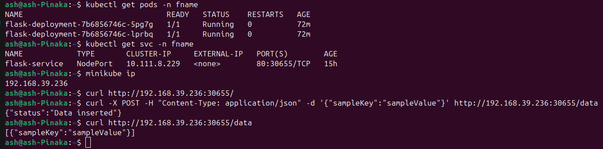
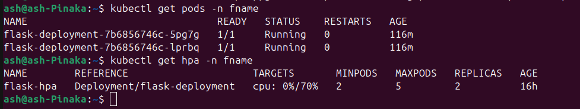
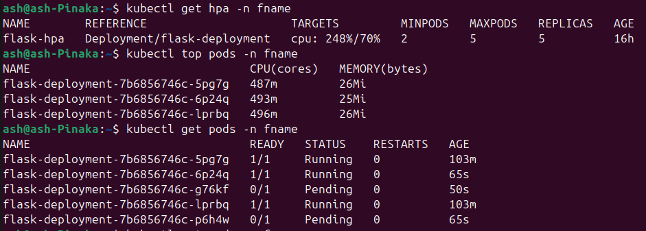
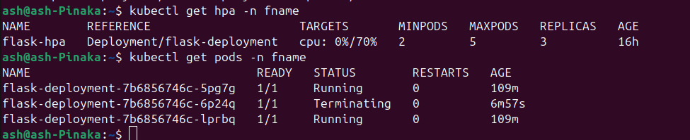

# Two-tier Flask Application


## Flask App with MongoDB on Kubernetes
Welcome to the Flask App with MongoDB on Kubernetes project! This repository contains the code and configurations for deploying a Flask application with MongoDB using Kubernetes. The goal of this project is to demonstrate how to containerize a Flask app, set up a MongoDB database with authentication, and deploy them on a Kubernetes cluster with best practices like persistent storage, resource management, and autoscaling.

### Project Overview
This project includes:
ash@ash-Pinaka:~/Documents/BuyFlask$ tree
```
.
├── app.py
├── docker-compose.yml
├── Dockerfile
├── flaskk8s
│   ├── flask-deploy.yaml
│   ├── flask-secret.yaml
│   └── hpa.yaml
├── mongo-init.js
├── monk8s
│   ├── conf.yaml
│   ├── mongodb-pv.yaml
│   ├── mstate.yaml
│   └── secret.yaml
├── namespace.yaml
├── README.md
└── requirements.txt
```
Flask Application: A simple Python Flask app with two endpoints:
- GET /: Returns a welcome message along with the current date and time.
- GET/POST /data: Allows storing and retrieving data from MongoDB.
MongoDB: A database configured with authentication to securely store data.
Kubernetes Setup: Deployment of the Flask app and MongoDB using Kubernetes, with services, persistent volumes, and autoscaling configured.

### Deployment Steps
Use Github action pipeline for containerzing the flask and pushing it to a private repository.
```
├── .github
    ├── workflows
        ├── release-please.yml
```
When you push to the main branch, ensure that you tag the commit with a version number eg: v1.0.2
```
git tag v1.0  # Create a tag named "v1.0"
git push origin master  # Push the master branch
git push origin --tags  # Push all tags
```
> Note: This tag is required by the docker/metadata-action@v5 ,GitHub Action to extract metadata from Git reference and GitHub events. This action is to tag and label Docker images.

Create a minikube cluster.
```
minikube start
```
First we will create namespaces used to logically divide a cluster into isolated environments.
```
kubectl apply -f namespace.yaml

```
**MongoDB Database Deployment**

Create the Secrets for MongoDB (convert the sensitive information to base64 format):
```
kubectl apply -f monk8s/secret.yaml
```
Create the Persistent Volume (PV) and Persistent Volume Claim (PVC):
```
kubectl apply -f monk8s/mongodb-pv.yaml
```
Apply the MongoDB ConfigMap:
```
kubectl apply -f monk8s/conf.yaml
```
Deploy MongoDB StatefulSet:
```
kubectl apply -f monk8s/mstate.yaml
```
**Flask Application Deployment**
Create a Docker secret to authenticate with the private docker repository to pull the image.
```
kubectl create secret docker-registry my-registry-secret   --docker-username=<username>   
--docker-password=<PAT-token-value>   
--docker-email=<email-id>   
--namespace=<namespace-name>

```

Create the Secrets for Flask:
```
kubectl apply -f flaskk8s/flask-secret.yaml
```
Set Up Autoscaling for Flask:
```
kubectl apply -f flaskk8s/hpa.yaml
```
Deploy the Flask Application:
```
kubectl apply -f flaskk8s/flask-deploy.yaml
```
### Communication from one namespace to other
By default, services are accessible from any namespace using the fully qualified domain name (FQDN).
The DNS name format for services in different namespaces is:
```
<service-name>.<namespace>.svc.cluster.local
```
Add the following MONOGODB_URI env to the flask application , edit the secrets.
```
MONOGODB_URI:mongodb://<user-name>:<user-passowrd>@mongo-service.mongo-namespace.svc.cluster.local:27017/<database-name>
```
### HEALTH metrics and Load Testing
**Installing Health metrics**

Download the metrics-server Deployment Manifest
```
curl -LO https://github.com/kubernetes-sigs/metrics-server/releases/latest/download/components.yaml
```
Edit the Manifest to Include --kubelet-insecure-tls
Apply the Modified Manifest
After making the changes, apply the updated manifest to your cluster:
```
kubectl apply -f components.yaml
```

**Testing the HPA**

Generate Load Using ApacheBench
```
sudo apt-get install apache2-utils
```
Use ab to simulate load. Replace <your-service-url> with your application’s service URL.
```
ab -n 50000000 -c 200 http://<your-service-url>/
```

### Images:
Successful Deployment


Before Load


During Load


After Load



